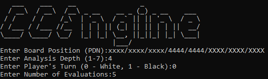

# CEngine
CEngine is a basic Checkers engine created using the base C language. 
The source code contains game logics, move simulation, board evaluation 
as well as the main engine constructing and selecting the top move sequences.

Engine itself supports CLI for game move suggestions per board position 
and it can also be accessed through Checkers app for GUI.


## Prerequisites
The program was developed in C using the [MinGW-w64 6.0](https://www.mingw-w64.org/) 
environment and [CMake 3.20.2](https://discourse.cmake.org/t/cmake-3-20-2-available-for-download/3237) 
for build automation.


## Getting Started
To run the engine download and run the Checkers_Engine.exe.

You can also compile and run the program from source code by
downloading the source files and ensuring the below directory:
```
+-- cmake-build-debug
|   +-- CMakeFiles
|   +-- Testing
|   +-- Checkers_Engine.cbp
|   +-- Checkers_Engine.exe
|   +-- cmake_install.cmake
|   +-- CMakeCache.txt
|   +-- MakeFile.file
+-- CMakeLists.txt
+-- board.h
+-- engine.h
+-- evaluation.h
+-- main.c
+-- move_logics.h
+-- move_tree.h
+-- simulation.h
```


## CLI Interface
The Command Line Interface is built-in to the engine and provides 
move sequence suggestions per given Checkers board position.

As mentioned above, run the Checkers_Engine.exe and enter the input requests
<p> </img> </p>

- [*What is PDN?*](https://github.com/ArastunM/Checkers/blob/main/PDN_Specification.pdf)


The engine will then process the input, output the [visualization](demo/CLI_all.PNG) of
given board position and suggest requested amount of top move sequences.


## About The Engine
### *Understanding Move Suggestions*
A given move sequence suggestion consists of the player making the move,
coordinates the piece moves from and the coordinates it moves to.

For example; *{White; [5][1] -> [4][1]}* is a move
by White pieces from [5][1] to [4][1]. For board coordinates
refer to [labeled board](images/labeled_board.png).

### *Work Process*
The program makes use of a move tree structure and builds all potential game
moves from given position. A single move is represented as a tree node containing
the move coordinates, player making the move and evaluation at that move. Subsequently, a
path from one node to another becomes a move sequence.

After the move tree is built, the program collects all leafs of that tree, determines the
leaf node with best evaluation for given player (or top best evaluations) and outputs the
path to node(s).
<p> </img> </p>

### *Used Files*
The program primarily operates based on files given below:
- **[main.c]** - central module launching the app / CLI interface
- **[board.h]** - contains Checkers piece, board and board coordinate related code
- **[move_logics.h]** - accomodates all necessary game move logics / rules
- **[simluation.h]** - used to simulate potential game moves from a given position
- **[evaluation.h]** - provides board evaluation methods
- **[move_tree.h]** - contains move tree structure and related code 
- **[engine.h]** - main engine used to build and print out top move sequences


## Details
- Author - Arastun Mammadli
- License - [MIT](LICENSE)
